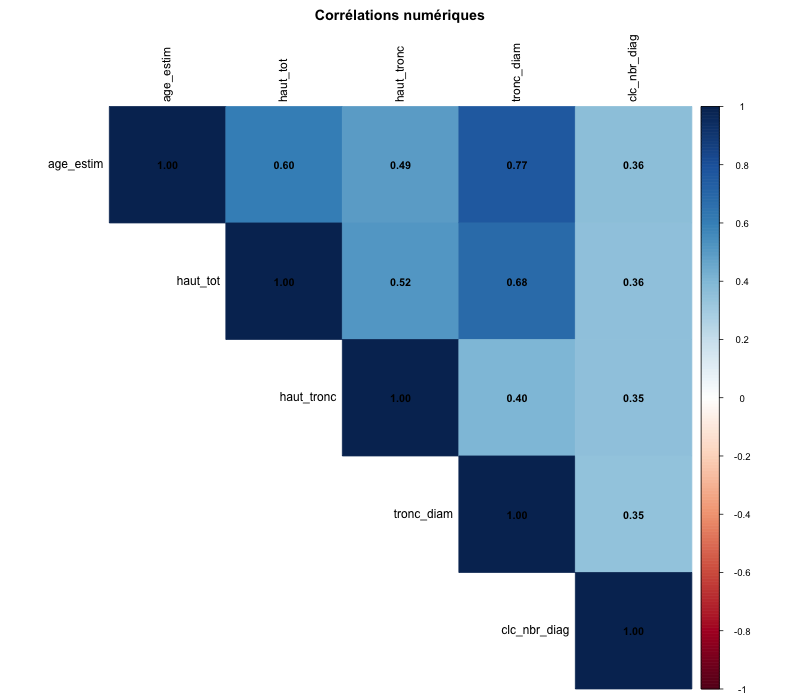
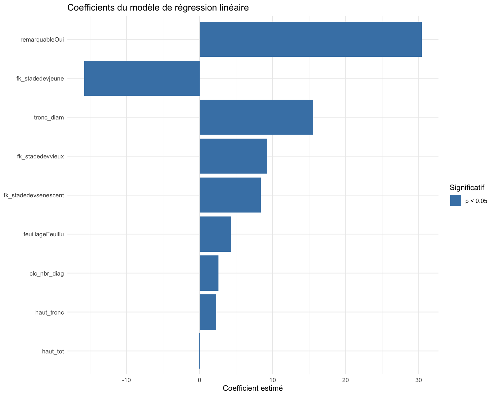
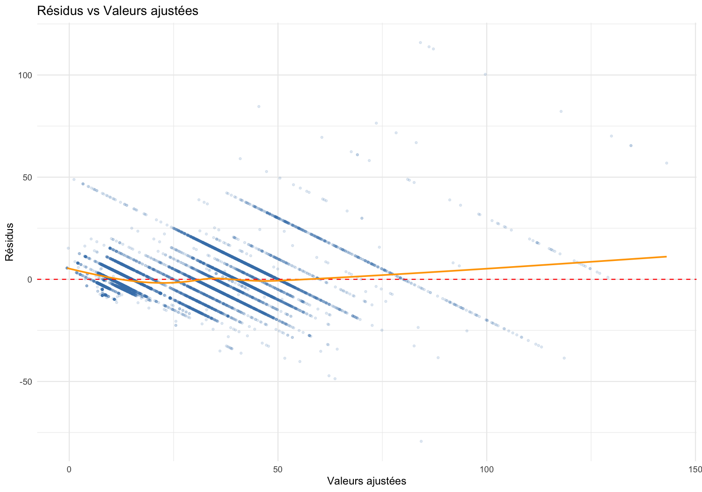
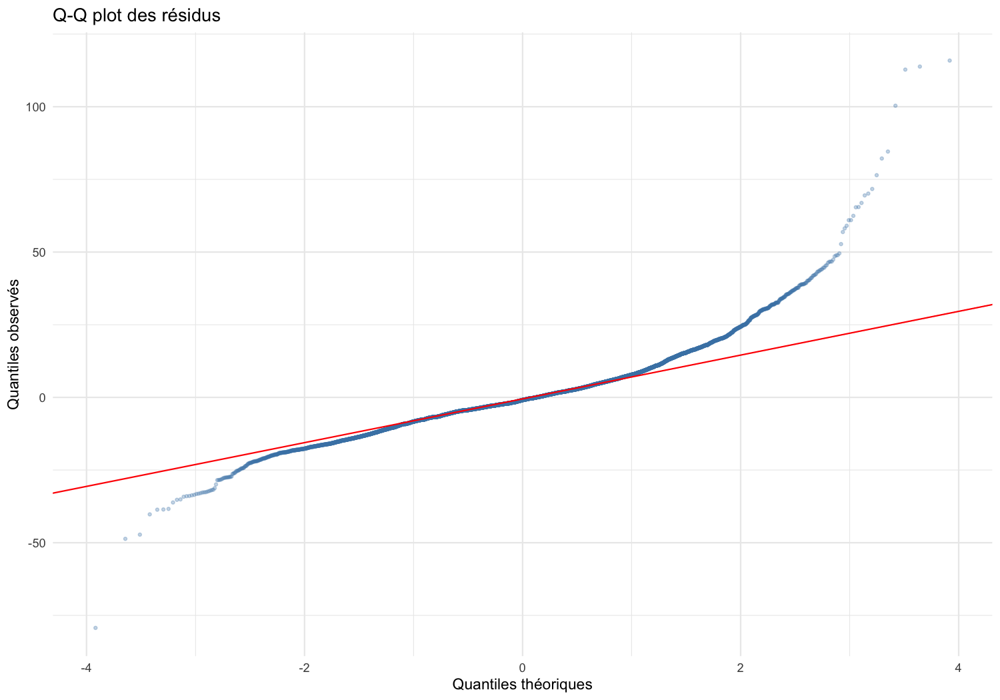
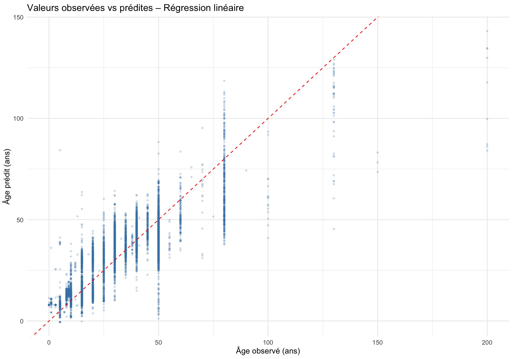
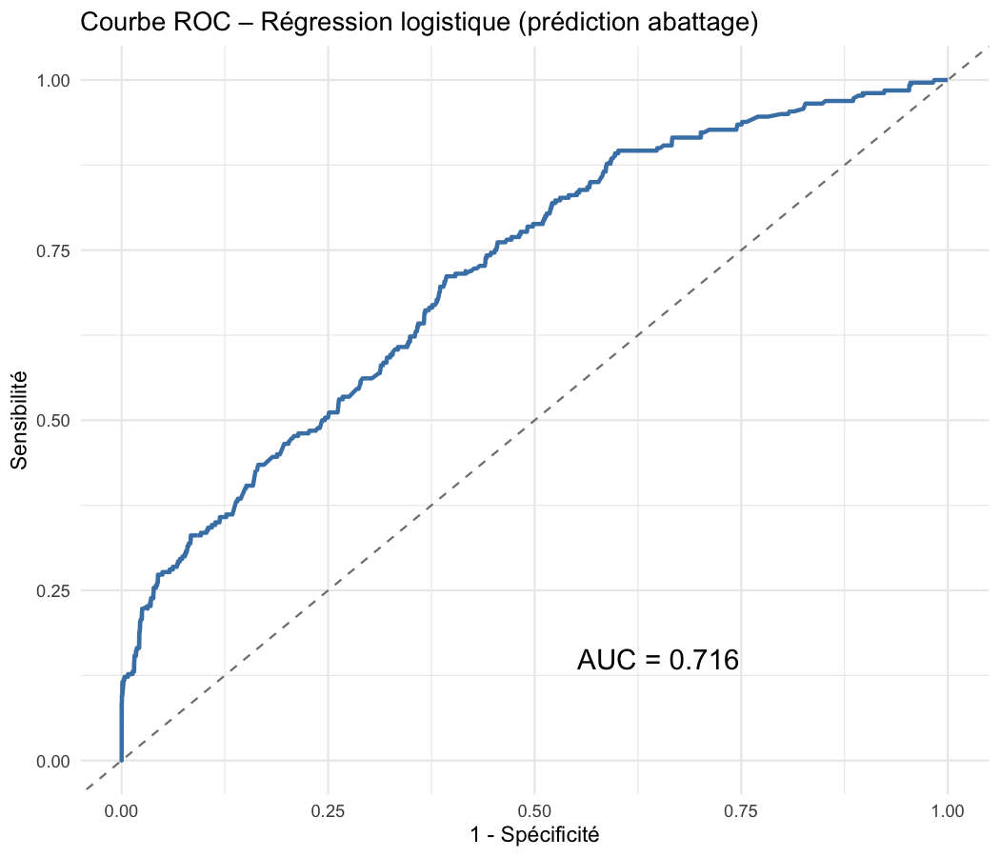
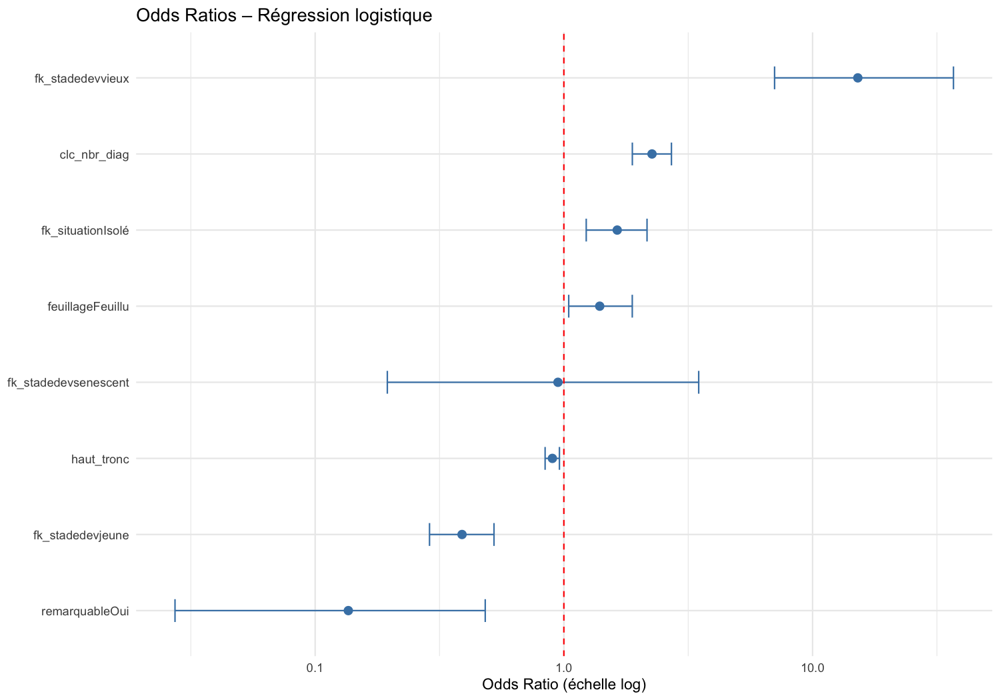
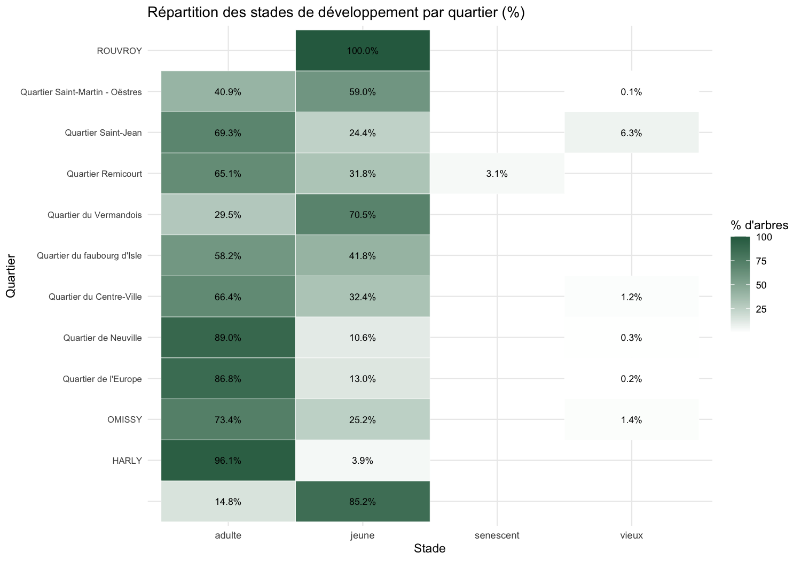
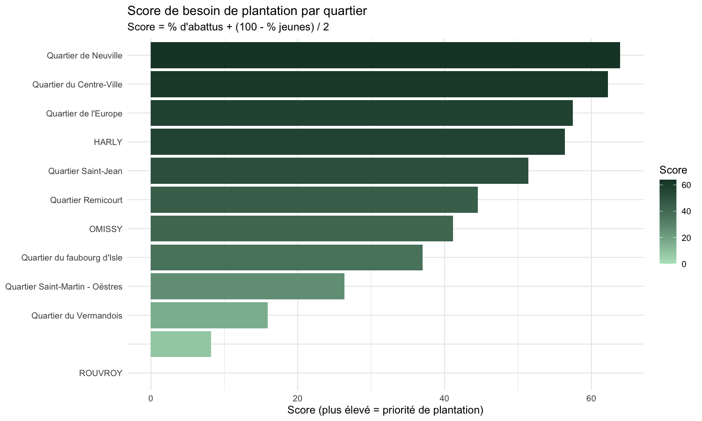
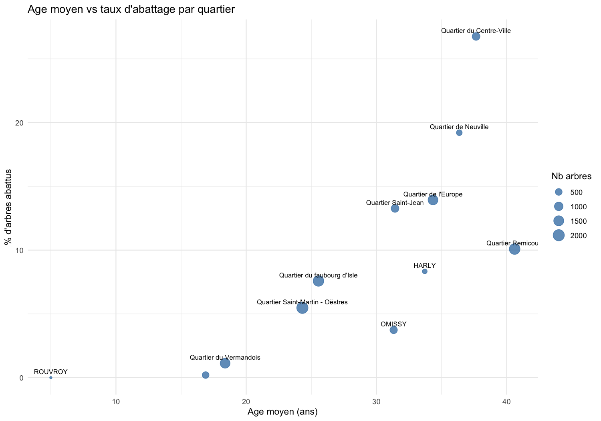

# Fonctionnalité 5 – Prédiction et analyse de régression

**Jeu de données :** `Patrimoine_Arboré_data_clean.csv` — 11 418 arbres, 23 variables  
**Outil :** R 4.4.2 — librairies `MASS`, `dplyr`, `ggplot2`, `car`, `pROC`, `corrplot`  
**Script :** `prediction.R` — Figures générées dans `figures/`

---

## Partie A – Régression linéaire : prédire l'âge estimé

### A.1 – Corrélations numériques



| | age_estim | haut_tot | haut_tronc | tronc_diam | clc_nbr_diag |
|---|---|---|---|---|---|
| **age_estim** | 1.000 | 0.601 | 0.490 | **0.769** | 0.363 |
| **haut_tot** | 0.601 | 1.000 | 0.516 | 0.685 | 0.357 |
| **tronc_diam** | 0.769 | 0.685 | 0.401 | 1.000 | 0.347 |

Le diamètre du tronc est la variable numérique la plus corrélée à l'âge (r = 0.769), devant la hauteur totale (r = 0.601). Ces corrélations élevées justifient leur inclusion comme prédicteurs principaux.

---

### A.2 – Modèle complet puis sélection par AIC (stepwise)

Le modèle complet inclut les 4 variables numériques et 4 variables qualitatives. La sélection `stepAIC` (bidirectionnelle) retire `fk_situation` (non significative, p > 0.1), aboutissant au modèle final :

```
age_estim ~ haut_tot + haut_tronc + tronc_diam + clc_nbr_diag
           + fk_stadedev + feuillage + remarquable
```

**Performances du modèle :**

| Métrique | Valeur |
|---|---|
| R² | **0.7449** |
| R² ajusté | 0.7446 |
| RMSE | **10.31 ans** |
| F-statistic | 3622 (p < 2.2e-16) |
| Effectif | 11 177 observations |

Le modèle explique **74.5 %** de la variance de l'âge estimé, avec une erreur moyenne d'environ **10 ans**.

---

### A.3 – Coefficients et significativité



| Variable | Coefficient | Interprétation |
|---|---|---|
| `remarquableOui` | +30.40 | Un arbre remarquable est estimé **30 ans plus vieux** toutes choses égales par ailleurs |
| `fk_stadedevjeune` | −15.80 | Un arbre jeune est estimé **16 ans moins vieux** qu'un adulte |
| `tronc_diam` | +15.54 | Chaque mètre supplémentaire de diamètre ajoute **15.5 ans** |
| `fk_stadedevvieux` | +9.28 | Stade vieux = **+9 ans** vs adulte |
| `fk_stadedevsenescent` | +8.34 | Stade sénescent = **+8 ans** vs adulte |
| `feuillageFeuillu` | +4.24 | Les feuillus sont estimés **4 ans plus vieux** que les conifères |
| `clc_nbr_diag` | +2.56 | Chaque diagnostic supplémentaire ajoute **2.6 ans** |
| `haut_tronc` | +2.26 | Chaque mètre de hauteur de tronc ajoute **2.3 ans** |
| `haut_tot` | −0.11 | Effet négatif très faible (redondance avec tronc_diam) |

Toutes les variables sont significatives à p < 0.001, sauf `haut_tot` (p ≈ 2.1e-5, restée au seuil).

---

### A.4 – Diagnostics du modèle




- **Résidus vs valeurs ajustées** : la variance des résidus est globalement stable (légère hétéroscédasticité pour les grands âges), sans structure systématique marquée.
- **Q-Q plot** : la normalité des résidus est respectée au centre de la distribution ; les queues montrent quelques valeurs extrêmes, attendues pour un jeu de données avec des arbres très anciens.

---

### A.5 – Valeurs observées vs prédites



Les prédictions suivent bien la diagonale (ligne rouge idéale). La dispersion s'élargit pour les ages > 80 ans (peu représentés), ce qui est cohérent avec un effectif réduit dans ces classes d'âge.

---

## Partie B – Régression logistique : identifier les arbres à abattre

**Variable cible :** `fk_arb_etat` — **ABATTU = 1** (860 cas) / **EN PLACE = 0** (10 317 cas)  
**Découpage :** 70 % entraînement / 30 % test — graine fixée à 42

### B.1 – Modèle sélectionné (stepAIC)

```
abattu ~ haut_tot + haut_tronc + age_estim + clc_nbr_diag
       + fk_stadedev + fk_situation + feuillage + remarquable
```

`tronc_diam` a été retiré par le stepAIC (colinéarité avec `age_estim`).

---

### B.2 – Performances sur le jeu de test

**Matrice de confusion (seuil 0.5) :**

| | Réel 0 (EN PLACE) | Réel 1 (ABATTU) |
|---|---|---|
| **Prédit 0** | 3 092 | 235 |
| **Prédit 1** | 2 | 25 |

| Métrique | Valeur | Commentaire |
|---|---|---|
| Accuracy | 92.9 % | Trompeuse (classes déséquilibrées) |
| Précision | 92.6 % | Quand on prédit abattu, on a raison 93 % du temps |
| Rappel | 9.6 % | Le modèle ne détecte que 10 % des arbres à abattre |
| F1-score | 0.174 | Faible — reflet du déséquilibre des classes |
| **AUC** | **0.716** | Discrimination correcte, meilleure qu'aléatoire |

Le déséquilibre fort (7.7 % d'abattus) explique le faible rappel au seuil 0.5. Pour un usage opérationnel, il faudrait abaisser le seuil de décision ou rééchantillonner les classes (SMOTE).

---

### B.3 – Courbe ROC



L'AUC de **0.716** indique que le modèle discrimine correctement les arbres abattus des arbres en place, malgré le déséquilibre. La courbe se détache nettement de la diagonale aléatoire.

---

### B.4 – Odds Ratios



| Variable | OR | Interprétation |
|---|---|---|
| `fk_stadedevvieux` | **15.2** | Les arbres vieux ont 15× plus de risque d'être abattus |
| `clc_nbr_diag` | **2.26** | Chaque diagnostic supplémentaire double le risque |
| `fk_situationIsolé` | **1.64** | Les arbres isolés sont plus souvent abattus |
| `feuillageFeuillu` | **1.39** | Les feuillus légèrement plus abattus que les conifères |
| `remarquableOui` | **0.14** | Les arbres remarquables sont très protégés (−86 % de risque) |
| `fk_stadedevjeune` | **0.39** | Les jeunes arbres sont peu abattus (−61 %) |

**Conclusion :** les arbres vieux en mauvais état sanitaire (clc_nbr_diag élevé), isolés et non remarquables sont les profils les plus à risque d'abattage.

---

## Partie C – Zones prioritaires de plantation

**Objectif :** identifier les quartiers où la ville devrait concentrer ses nouvelles plantations pour harmoniser le développement arboré.

**Score de besoin :** `score = % abattus + (100 − % jeunes) / 2`  
Un score élevé signale un quartier avec beaucoup d'abattages et peu de renouvellement.

### C.1 – Répartition des stades par quartier



### C.2 – Score de besoin de plantation



| Quartier | Total | % Jeunes | % Abattus | Score | Priorité |
|---|---|---|---|---|---|
| Quartier de Neuville | 302 | 10.6 % | 19.2 % | **66.7** | ★★★ |
| Quartier du Centre-Ville | 740 | 29.1 % | 26.8 % | **62.2** | ★★★ |
| Quartier de l'Europe | 1 428 | 13.0 % | 13.9 % | **57.4** | ★★ |
| HARLY | 156 | 3.9 % | 8.3 % | **56.4** | ★★ |
| Quartier Saint-Jean | 746 | 23.7 % | 13.3 % | **51.5** | ★★ |
| Quartier du Vermandois | 1 416 | 70.4 % | 1.1 % | **15.4** | ✓ (sain) |

### C.3 – Âge moyen vs taux d'abattage



**Recommandations :**

- **Quartier de Neuville** (score 66.7) : seulement 10.6 % de jeunes arbres et 19.2 % d'abattus — renouvellement urgent.
- **Quartier du Centre-Ville** (score 62.2) : forte proportion d'abattages (26.8 %), espaces contraints mais besoin réel de replantation.
- **Quartier de l'Europe** (score 57.4) : grand quartier peu doté en jeunes arbres, potentiel de verdissement important.
- **Quartier du Vermandois** : déjà 70 % de jeunes arbres — pas de priorité immédiate.

---

## Synthèse générale

| Partie | Modèle | Performance clé |
|---|---|---|
| A – Régression linéaire | lm (stepAIC) | R² = 0.745 / RMSE = 10.3 ans |
| B – Régression logistique | glm binomial (stepAIC) | AUC = 0.716 / Accuracy = 92.9 % |
| C – Zones de plantation | Analyse descriptive par quartier | Neuville et Centre-Ville prioritaires |

**Variables les plus importantes pour prédire l'âge :** `tronc_diam` (r = 0.77), `fk_stadedev` (eta² = 0.54), `remarquable` (+30 ans).  
**Profil d'arbre à risque d'abattage :** vieux, isolé, plusieurs diagnostics, non remarquable (OR vieux = 15.2).
